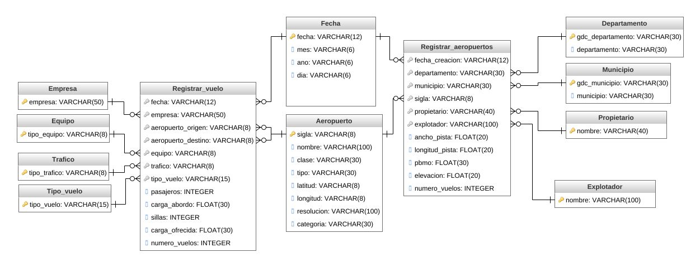

# Visible infraestructure
#### ***MIID course: ETL and data modeling - University of the Andes***

Infraestructura visible is an initiative of University of the Andes whose objective is to collect, analyze and centralize information of different government institutions about the current and future infrastructure of Colombia. [link to the project](https://www.infraestructuravisible.org/).

In this course I was tasked with consultant duties. The organization gave us data related with airports and flights from Colombia and they were hoping to solve a set of analytical requirements. The ones that I aimed to solve are listed next:
  
  #### Visualize the number of passengers tranported in a range of dates within Colombia.
  #### Visualize the number of empty seats in flights in a range of dates within Colombia.  
  ####  Analize the relationship between the GDP and the number of flights in the department of Colombia. 
  
For all the three requirements it was implmented an ETL process that takes the data from a github repository, process it using pyspark and then load into a SQL server database. 

## This is the database ER model. 

This [file](https://github.com/jglobaton10/Visibleinfrastructure/blob/main/database.sql) can be used to create and populate the tables. 

<iframe width="700" height="420" src="https://app.powerbi.com/reportEmbed?reportId=7e610e80-2e16-4aff-aab1-b27d87e988bd&autoAuth=true&ctid=4488e84d-b763-4538-aca2-e5e104ce5246&config=eyJjbHVzdGVyVXJsIjoiaHR0cHM6Ly93YWJpLXVzLW5vcnRoLWNlbnRyYWwtZy1wcmltYXJ5LXJlZGlyZWN0LmFuYWx5c2lzLndpbmRvd3MubmV0LyJ9" frameborder="0" allowFullScreen="true"></iframe>
